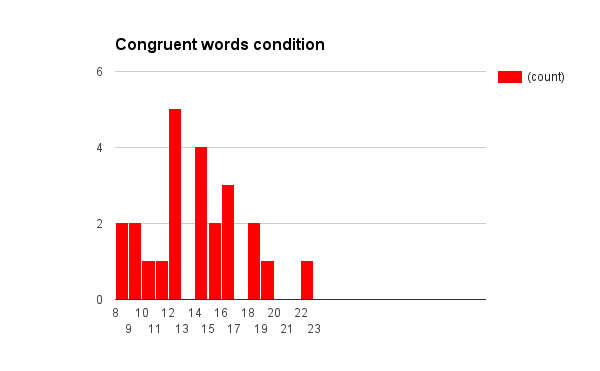
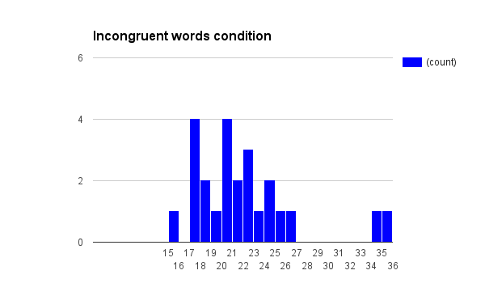

## Test a Perceptual Phenomenon

#### [Stroop effect](https://en.wikipedia.org/wiki/Stroop_effect)

#### Question 1

> *What is our independent variable? What is our dependent variable?*

The Stroop task is an experiment. In this experiment, we can manipulate the condition of word and color.
So the condition is the independent variable.

The time, which a participant spent to name the ink colors, been recorded is the outcome of the experiment.
It also called the dependent variable.

#### Question 2

> *What is an appropriate set of hypotheses for this task?
> What kind of statistical test do you expect to perform? Justify your choices.*

In Stroop task, each participant will go through each condition, so the recorded time are dependent samples.
And I want to figure out if the difference of mean time between two conditions is significant.

Here I define the population mean from the congruent words condition as *μ*con,
and the population mean from the incongruent words condition as *μ*inc.

The null hypotheses should be the case that the difference are zero. I can write the null hypotheses as: 

*H*0 : *μ*con - *μ*inc = 0

And the alternative hypotheses is against the null hypotheses, means the difference exists.
It can be written as:

*H*a : *μ*con - *μ*inc ≠ 0

Also I don't know the population statistics,
I need to perform a two-tailed t-test for paired samples to examine if I can reject the null.

#### Question 3

> *Report some descriptive statistics regarding this dataset.
> Include at least one measure of central tendency and at least one measure of variability.*

| Condition | Sum | Mean | Min | Median | Max | IQR |  SD  |
| :-------: | --: | ---: | --: | -----: | --: | --: | ---: |
|   Congruent | 337.227 | 14.051 |  8.63  | 14.3565 | 23.328 | 4.3055  | 3.559 |
| Incongruent | 528.382 | 22.016 | 15.687 | 21.0175 | 35.255 | 5.33475 | 4.797 |

#### Question 4

> *Provide one or two visualizations that show the distribution of the sample data.
> Write one or two sentences noting what you observe about the plot or plots.*

When I look at the plots first time, I found there are outliers in the outcome of incongruent words condition.
And then I confirmed it by comparing those values with IQR. They are larger than median plus 2.5 IQR.
If we exclude the outlier, it seems the record times from congruent words are more sparse.

#### Question 5

> *Now, perform the statistical test and report your results.
> What is your confidence level and your critical statistic value?
> Do you reject the null hypothesis or fail to reject it?
> Come to a conclusion in terms of the experiment task.
> Did the results match up with your expectations?*

I expect the time from incongruent words condition is significant higher than from congruent words condition.

1. Calculate the sample standard deviation for difference between two conditions. And I got 
   s = 4.865
2. The t-statistic is meancon - inc / (s / n ^ 0.5) = -8.021
3. I choose the 95% confidence level for this two-tailed test, the t-critical values are ±2.064
4. The t-statistics is out of the range between two t-critical values, so I reject the null.
5. Even if I choose the 99% confidence level, the t-critical values are ±2.797. Reject the null.

The result of t-test shows the difference is significant, and the t-statistic has a negative value.
So I can confirmed my expectation, incongruent words condition takes participants more time to name the color.

#### Question 6

> *What do you think is responsible for the effects observed?
> Can you think of an alternative or similar task that would result in a similar effect?
> Some research about the problem will be helpful for thinking about these two questions!*

My first thought about the Stroop Effect is the result of conflict information processing by human brain.
For the congruent case, because word is the print color, it is easy to speak out loud without thinking.
But when the word and the print color is conflict, human brain need to do decide the desired information before speaking.
So the conflict information caused more response time.

And I found the Wikipedia describe it as: "In psychology, the Stroop effect is a demonstration of interference in the reaction time of a task."
The Wiki article also state several theories explaining this effect.

- Processing speed
- Selective attention
- Automaticity
- Parallel distributed processing

These are more completed than my original thought.

An alternative task is a variation of Irish Snap.
The Irish Snap start with a shuffled deck and then spread the cards out equally to every players.
Players are not allowed to see their cards.
Each player move top card of their stack to the middle of the table in turn.
And reveal the card, speak out loud the number of cards revealed.
When the number of cards exceed 13, the count back to the 1.
If the number spoken is exact the number represented by the just reveal card, everyone should slam that card.
The last one have to pick up all revealed cards, and start the next round.
Game ends when a player collected every cards, and he lose.
Sometimes the additional rules are applied to make this game even excited.
Such as plus n and minus m.
It means the card count plus n or minus m are also match the spoken number.

The above card game contains interference when the card number are not the spoken number.
And the additional rule plus n and minus m is also a kind of interference.
Theories explained the Stroop Effect in the Wiki article can explained this game as well.

- The processing speed of listening the spoken number is quick than card number recognizing and arithmetic.
- Brain need more attention for recognizing the card, adding or subtracting number.
- Sometimes player make mistake to slam when number is not match. This could caused by the automaticity.
- Players analyze different kind information simultaneously, the strength will be different.

This card game was popular in my childhood.
And I didn't noticed that there are some interesting explantaion behind!